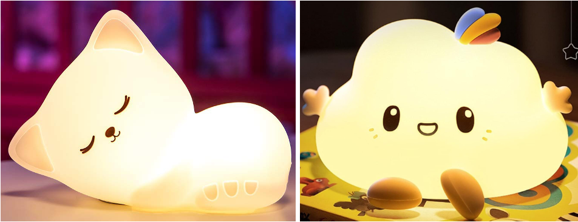
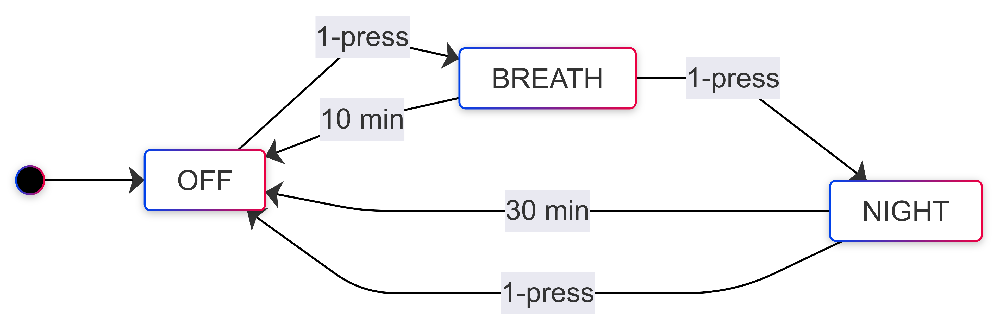

# Berrythe

## Objective

Create a low-cost alternative for a breathing assistant toy in India by replacing the circuitry of a night light toy. The working is similar these toys in these Amazon US [shopping link 1](https://a.co/d/hcPQM95), [shopping link 2](https://a.co/d/2bBX1N4). Below is a video of the resulting breathing sequence from a retrofit night light toy.

https://github.com/user-attachments/assets/268d343a-7a08-4612-9922-748c09accf75

This open-source project is done for [Cranberry.fit](https://cranberry.fit), a company developing personalized care products to improve menstrual health.

## Repository Content

This repository contains both the hardware and firmware for Berrythe - KiCad PCB design and TI Code Composer Studio Project. The respective hardware and firmware folders contain their documentation as well.

## Specifications of toy

1. Overall, the two functional modes are
    1. Breathing mode of 4, 7, 8
    2. Yellow night light mode
2. This needs to be compatible with the toys below (Amazon India [shopping link 1](https://amzn.in/d/7s0jjhx), [shopping link 2](https://amzn.in/d/guYvsHx))

3. Additional cost for the electronics at quantity of 1000 needs to be less than 300 INR.
4. Battery life
    1. Breathing or Night light mode need needs to be able to run at least for 8 hours on a full charge.
    2. In OFF mode the battery should last at least 6 months.

### Operations of the toy

1. Overall there are three modes for the toy, namely
    1. Power down mode (OFF)
    2. Breathing mode (BREATH)
    3. Yellow night light mode (NIGHT)
2. There is one button for user input interaction, at the bottom of the toy. The two means of interaction with this button is single-press or double-press. Double press isn’t used as it reduces good user experience. 
3. The breathing mode will be on for a time of 10 minutes, following which it’ll power down.
4. The night light mode will be on for a time of 30 minutes, following which it’ll power down.
5. The following will be the flow of operation of the toy

6. The breathing mode timing would be as follows to provide an overall 4, 7, 8 breathing exercise. The green and blue color intensity would change as shown below, visually changing linearly. 

| Inhale | Tr | Hold | Tr | Exhale | Tr |
| --- | --- | --- | --- | --- | --- |
| 3.8s | 0.2s | 6.8s | .2s | 7.8s | 0.2s |
7. During the transition time of 0.2s (Tr in above table) the color will shift from previous one to the next one.

## Breathing Technique’s Why and How

### Slow, controlled breathing stimulates the parasympathetic nervous system

This is the part of the nervous system that slows down activity in the body, promotes relaxation, and thus alleviates anxiety and mood changes

### Slows down heart rate, blood pressure, and oxygen consumption

This breathing technique has a low inhale-to-exhale ratio (where you only inhale for 4 seconds and exhale for 8), and requires you to hold your breath. These specific practices may increase your blood oxygen levels and lower your blood pressure. All of which contribute to a less agitated, and more relaxed state.
