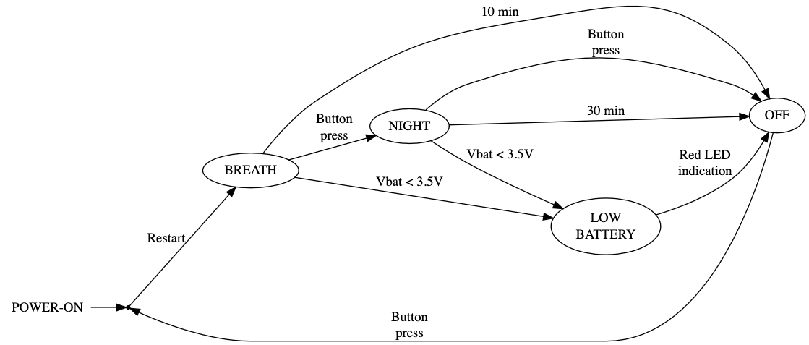
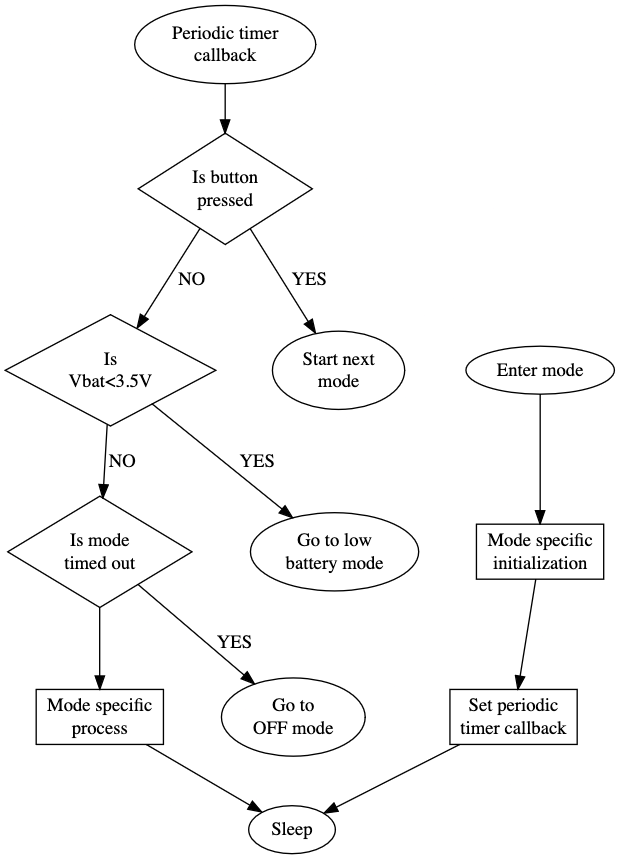

# Berrythe firmware documentation

The overarching requirement from the firmware is specified by the state machine below.

## Challenges

### Code memory size
[MSPM0C1103](https://www.ti.com/product/MSPM0C1103), the target micro-controller from TI is with a ARM Cortex M0+ processor, 1 kB RAM and 8 kB Flash as it is targeted for low-cost, simple applications. The primary challenge for the firmware was to develop the application within the code space available in Flash, especially the LED gamma correction algorithm explained below. The memory usage (-Os optimization) is as shown in the table below, although it might change a bit based on the commit.

| Memory       | Usage |
| --------     | ----- |
| RAM (1 kB)   | 12%   |
| Flash (8 kB) | 84%   |

### Gamma correction
Getting gamma correction to have pleasant visual transitions of LEDs and to have it fit in the 8 kB of flash needed iterations in the design. This is explained in detail further down.

## Project specific development principles
- Keep it simple - develop what's necessary for the project, not more. This project is not going to be a library for further use.
    - Important for both reliability and memory optimization.
- Use as much as possible vendor HAL driver and suitable external libraries. This would be the DriverLib from TI and  printf from Spare Time Labs 2.0.
    - One implication of this would be majority of the configuration of the peripherals of the is based on the System Configuration GUI tool from TI. The configuration is stored in a .syscfg file. Build triggers generation of a ti_msp_dl_config.c and .h file based on the .syscfg file.
- Optimize what is necessary, don't worry about the miniscule gains either in memory usage or power consumption.

## Low memory footprint printf library
Formatted prints over the UART line is an essential tool for debugging, even if the Code Composer Studio from TI along with XDS110 debugger provides complete debugging infrastructure of breakpoints, memory/variable views, and call-stacks.

[Tiny printf](http://www.sparetimelabs.com/tinyprintf/tinyprintf.php) from Spare Time Labs 2.0 is library being used, with it consuming 528 bytes on the Flash memory.

Alternatives considered were the [mpaland's printf fork maintained by eyalroz](https://github.com/eyalroz/printf) and [charlesnicholson's nanoprintf](https://github.com/charlesnicholson/nanoprintf). Both of them consume more memory than Tiny printf.

## BREATHE and NIGHT mode
The general flow of these two modes are as shown below.

Since in these modes the main power consumption is from the LEDs, there is less focus on optimizing the power consumption due to the MCU. The periodic timer callback wakes the MCU every millisecond. 

### BREATHE mode
Breathe mode is for the primary use of providing a breathing pattern for the user. Note that for the end user the color transition of green and blue need to appear to be changing linearly visually.

|Color    | Green | Purple | Blue |
|-------- | ----- | ------ | ---- |
|Duration | 4s    | 7s     | 8s   |

LP5810 LED driver has an auto mode where the LED pattern needed can be programmed in it's registers via I2C, such that it can generate the pattern automatically without involvement of the MCU. This mode didn't work as expected as detailed in this [forum question](https://e2e.ti.com/support/power-management-group/power-management/f/power-management-forum/1463546/lp5810-auto-pattern-not-as-per-what-gui-shows/). Thus, the manual mode is used where every millisecond a I2C write sets the LED intensity to be set by LP5810.

As the flash memory is limited and only linear transitions of color is needed, an approach of interpolating the LED brightness for each sequence is done. This is done by specifying the start and end brightness for the red, green and blue LEDs, along with the duration of the period of this sequence in arrays. By tracking the number of periodic timer calls in each sequence, the current value to be set for each of the three LEDs is interpolated based on the start and end values.

#### Gamma Correction

A technique called Gamma Correction is need to correct the LED brightness as it is changes in to make the perception with our eyes linear. Adafruit has a good [practical article](https://learn.adafruit.com/led-tricks-gamma-correction) on this.

Gamma correction can be done by LP5810, although this feature is not used. This is because it has only a 8-bit value to work on. Since initially the value to be set is generated as a 16-bit value, gamma correction is also done with this and then down-scaled to 8 bit value. This creates a smoother transition. This helped in fixing the blocky transition of the colors when using the inbuilt gamma correction of LP5810. 

To avoid usage of float variables as well as 'to the power of' operation of floats, the gamma value used for gamma correction is 2.0. This would need additional 2-3 kB of libraries for the float operations and would exceed the 8kB flash size. Using a gamma value of 2 enables working only on integers and gives a decent gamma correction visually.

### NIGHT mode
In night mode one of the generic timers (TIMG) is used to operate the warm white LEDs at a 10% duty cycle. LP5810 is disabled on the start of this mode. 

## OFF mode and low power considerations
In all modes except OFF mode, the MCU operates in SLEEP mode, where only the processor 

| Mode        | Low power | Operation |
| --------    | -----     | -----     |
| Other modes | SLEEP0    | Only processor is disabled |
| OFF mode    | STANDBY1  | Only GPIO and Timers (32kHz) are enabled |

Before initiating STANDBY1 low power state in the OFF mode, LP5810 is disabled and the MOSFET driving the night lights is turned off to remove their power consumption.

On waking up from OFF mode, the MCU does a software reset to start afresh in the BREATHE mode. This makes the firmware development easier since each mode's states don't have to be maintained across as they can be run at most once.

## Battery and charging check for low power mode
Voltage dividers are used to measure the battery voltage and the USB input voltage by the ADC of the MCU.  The different modes for the battery are computed as per the below table.

| State    | USB Power | Battery voltage   |
| ----     | --------- | ----------------- |
| CHARGING | Present   | Don't care        |
| NORMAL   | Absent    | Greater than 3.5V |
| LOW      | Absent    | Lower than 3.5V   |

Battery and USB power measurements are done approximately every 16s. On sensing LOW battery state, irrespective of the current mode of operation, LOW_BATTERY mode is entered. In this mode a short 3s sequence of red LED flashing is shown to user to indicate the mode. After this it goes to the OFF mode to conserve battery power. 

