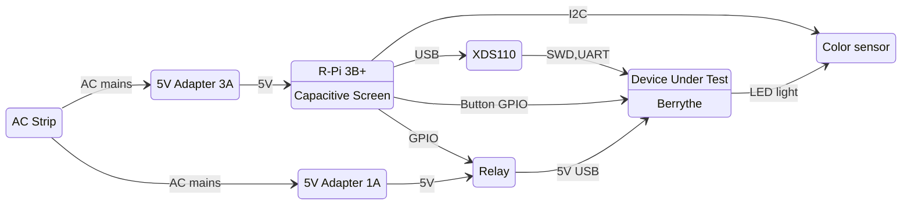

```mermaid
stateDiagram
  direction LR
  idR --> XDS110:USB
  XDS110 --> Berrythe:SWD,UART
  idR --> Berrythe:Button GPIO
  idR --> idC:I2C
  idAC --> idP1:AC mains
  idAC --> idP2:AC mains
  idR --> Relay:GPIO
  idP1 --> idR:5V
  idP2 --> Relay:5V
  Relay --> Berrythe:5V USB
  Berrythe --> idC:LED light
  idC:Color sensor
  idAC:AC Strip
  idP1:5V Adapter 3A
  idP2:5V Adapter 1A
  Berrythe:Device Under Test
  Berrythe:Berrythe
  idR:R-Pi 3B+
  idR:Capacitive Screen
```