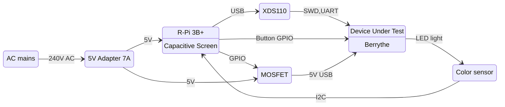

```mermaid
---
config:
  themeCSS: |
    #edge4, #edge6, #edge7, #edge8 { stroke: red; stroke-width: 2px; }
    #edge9 { stroke: green ; stroke-width: 2px;  stroke-dasharray="10,5"; }
---
stateDiagram
  direction LR
  idR --> XDS110:USB
  XDS110 --> Berrythe:SWD,UART
  idR --> Berrythe:Button GPIO
  idC --> idR:I2C
  idAC --> idP1:240V AC
  idR --> MOSFET:GPIO
  idP1 --> idR:5V
  idP1 --> MOSFET:5V
  MOSFET --> Berrythe:5V USB
  Berrythe --> idC:LED light
  idR:R-Pi 3B+
  idR:Capacitive Screen
  Berrythe:Device Under Test
  Berrythe:Berrythe
  idC:Color sensor
  idAC:AC mains
  idP1:5V Adapter 7A
  


```
